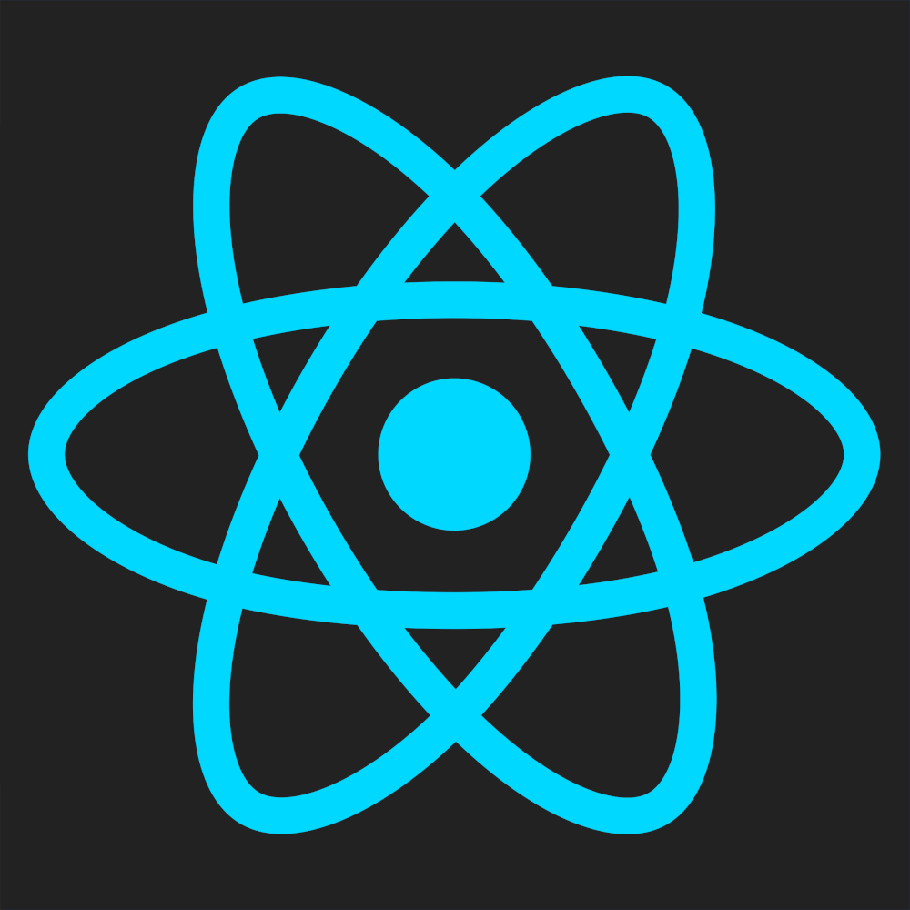
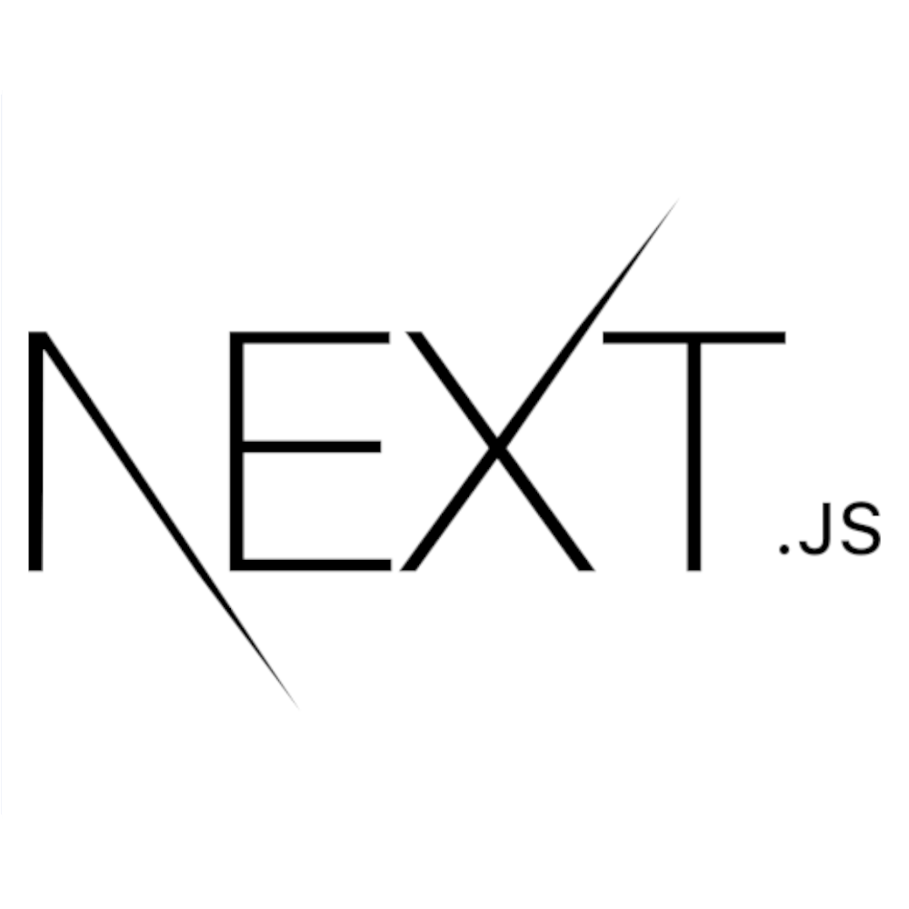
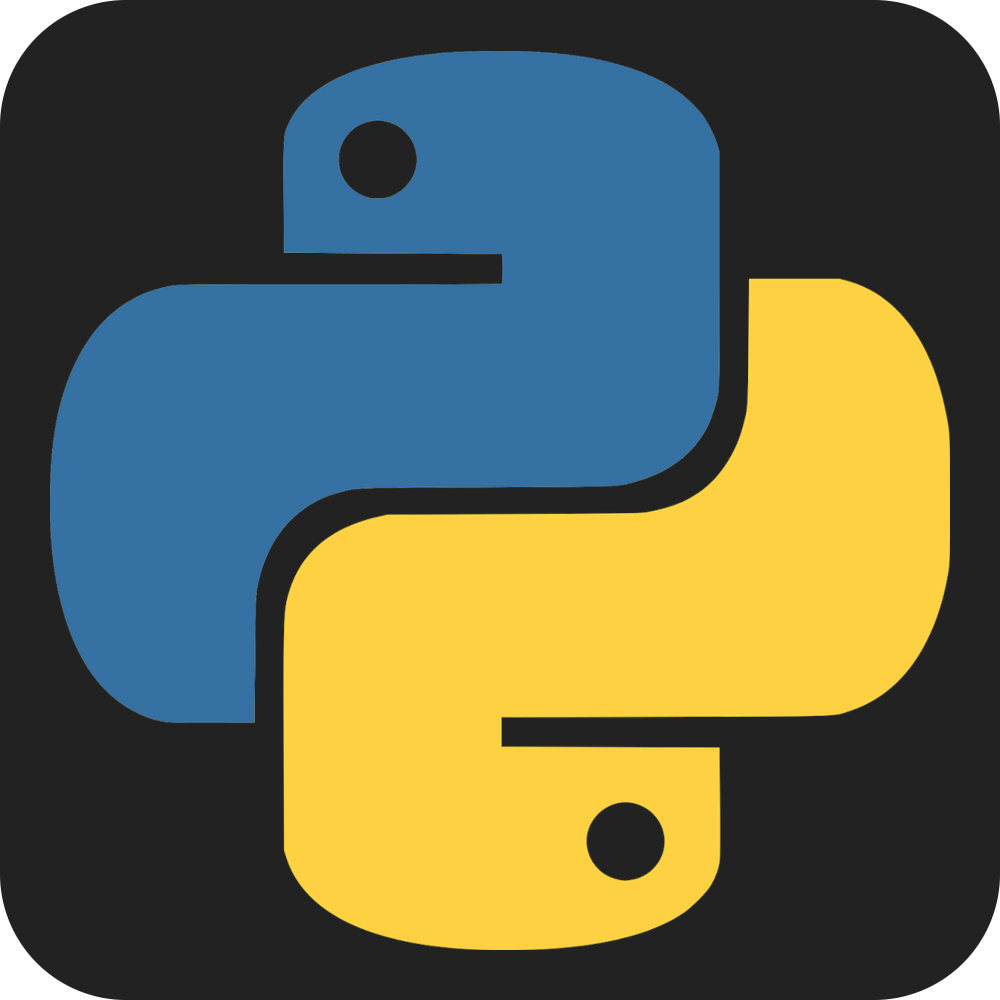

<h2 align="center">Hi 👋, I'm Gabriel</h2>
<h3 align="center">software engineering student( & musician 🎵)</h3>

 

  

<!---->

 

### Eu...
* 🎓 Estudo Engenharia de Software na **PUC Minas** [ 4º Período ]
* 🔭 Estou atualmente explorando **Java**🔥
* 💻 Estou desenvolvedo projetos em NextJs <!--**[Time-Brother](https://github.com/IPROjr-SI/IPRO-no-time-brother)**-->

### Ferramentas

#### O que estou estudando

&ensp;<code>

</code>&ensp;
&ensp;<code>

</code>&ensp;

#### O que sei fazer em Front-End 
&ensp;<code>

</code>&ensp;
&ensp;<code>

</code>&ensp;
&ensp;<code>

</code>&ensp;
&ensp;<code>

</code>&ensp;
&ensp;<code>

</code>&ensp;
&ensp;<code>

</code>&ensp;
&ensp;<code>

</code>&ensp;
<!--&ensp;<code>

</code>-->

