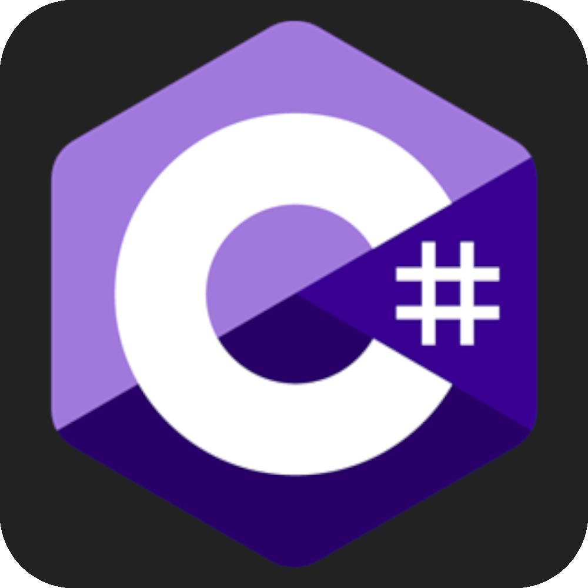

<h2 align="center">Hi 👋, I'm Gabriel</h2>
<h3 align="center">software engineering student( & musician 🎵)</h3>

 

  

<!---->

 

### Eu...
* 🎓 Estudo Engenharia de Software na **PUC Minas** [ 3º Período ]
* 🔭 Estou atualmente explorando **.NET**🔥
* 💻 Estou desenvolvedo projetos de um curso de C# e .NET <!--**[Time-Brother](https://github.com/IPROjr-SI/IPRO-no-time-brother)**-->
* 🎙 Participo do podcast **[Raio](https://open.spotify.com/show/5tzwuHAOYGp4ATskC6oT5c?si=NnujR6j9RiyGtVmNP1HKxw)**

### Notas Recentes 📝

* **Pensa num [livro](https://external-content.duckduckgo.com/iu/?u=https%3A%2F%2Ftse4.mm.bing.net%2Fth%3Fid%3DOIP.6quaXAlgnMGOzkhgIKEYTgHaHa%26pid%3DApi&f=1) insano de bom!**

### Ferramentas

### O Meu foco atualmente

&ensp;<code>

</code>&ensp;
&ensp;<code>

</code>&ensp;
&ensp;<code>

</code>&ensp;

### O Básico exigido para qualquer desenvolvimento web 
&ensp;<code>

</code>&ensp;
&ensp;<code>

</code>&ensp;
&ensp;<code>

</code>&ensp;
&ensp;<code>

</code>&ensp;
&ensp;<code>

</code>&ensp;
<!--&ensp;<code>

</code>-->

