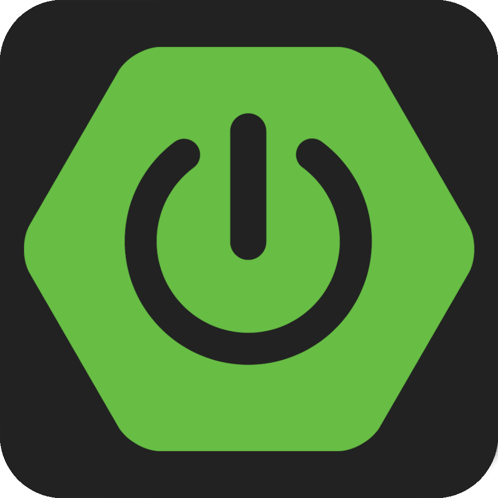
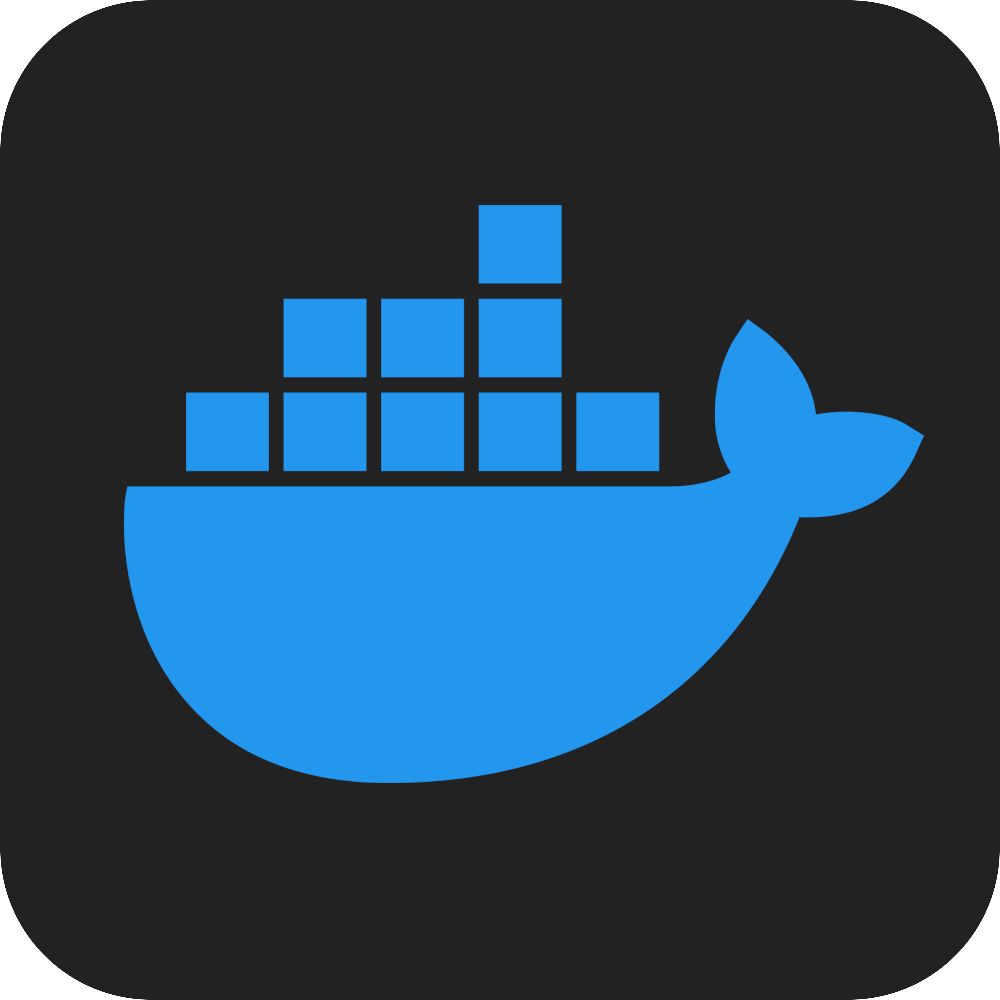
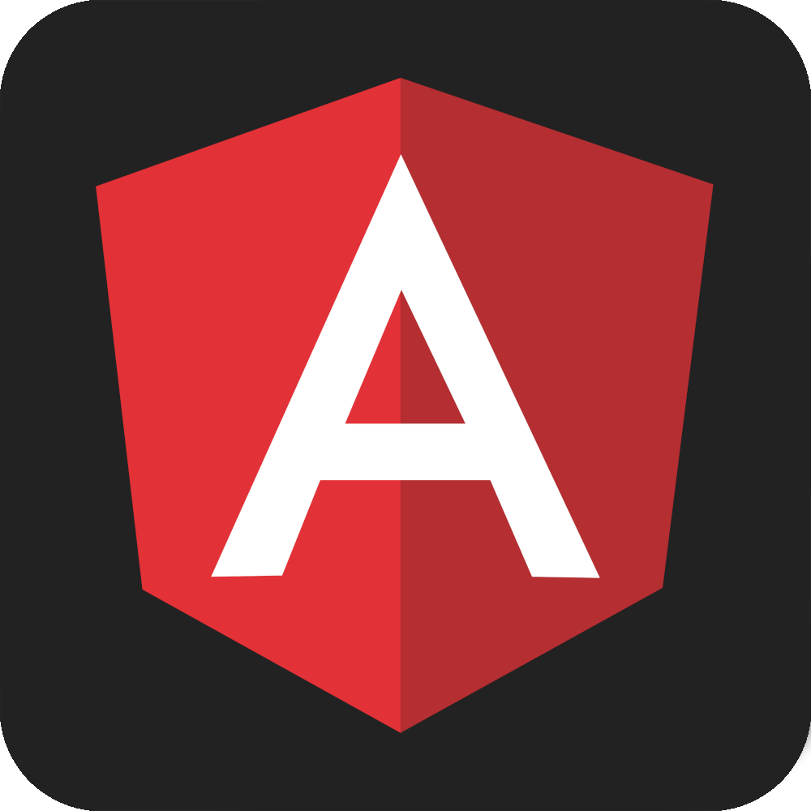

<h2 align="center">Hi 👋, I'm Gabriel</h2>
<h3 align="center">software engineering student( & musician 🎵)</h3>

 

  

<!---->

 

### 👨‍💻 About Me / Sobre Mim

* 🎓 I hold a degree in **Software Engineering** from **PUC Minas** (Brazil)

  > 🇧🇷 Graduado em Engenharia de Software pela **PUC Minas**

  * 🦀🎓 My final thesis (TCC) was written in **Rust**:
    **“Domain-Driven Design Based Code Visualization: An Approach for Knowledge Management and Understanding in Agile Teams”**

    > 🇧🇷 *Visualização de Código Baseada em Domain-Driven Design: Uma Abordagem para Compreensão e Gestão de Conhecimento em Equipes Ágeis*

  * 📄 I published a research paper during my undergraduate studies:
    **“Exploring YouTube as a Learning Source for Developers: A Large-Scale Analysis of Tech Videos”**
    Published in the *V Simpósio Brasileiro de Educação em Computação*, Juiz de Fora/MG, 2025, pp. 72–84.
    DOI: [https://doi.org/10.5753/educomp.2025.4930](https://doi.org/10.5753/educomp.2025.4930)

    > 🇧🇷 *Artigo publicado durante a graduação, analisando vídeos de tecnologia no YouTube como fonte de aprendizado para devs.*

* 🔭 I'm currently exploring and improving my skills in:

  * **Rust 🦀**, **Java ☕**, and **Spring Boot 🍃**
  * > 🇧🇷 Estudando e praticando Rust, Java e Spring Boot

* 💡 I'm deeply focused on mastering **Rust 🦀**, especially in:

  * 📐 Design Patterns / Padrões de Projeto
  * 🧱 Architecture / Arquitetura
  * 🔧 Code Maintenance / Manutenção de Código
  * ✅ Testing / Testes

### Technologies

#### 🚀 Currently mastering

<code></code>
<code></code>
<code></code>

#### ⚒️ Core skills

<code></code>
<code></code>
<code></code>
<code></code>
<code></code>
<code></code>
<code></code>
<code></code>

#### 🎨 Past Front-End Experience
<code></code>
<code></code>
<code></code>
<code></code>
<code></code>
<code></code>
<code></code>
<code></code>

<!-- #### O que estou estudando

&ensp;<code>

</code>&ensp;
&ensp;<code>

</code>&ensp;<code>

</code>&ensp;<code>

</code>&ensp;<code>

</code>&ensp;

#### O que sei fazer em Front-End 
&ensp;<code>

</code>&ensp;
&ensp;<code>

</code>&ensp;
&ensp;<code>

</code>&ensp;
&ensp;<code>

</code>&ensp;
&ensp;<code>

</code>&ensp;
&ensp;<code>

</code>&ensp;
&ensp;<code>

</code>&ensp;
<!--&ensp;<code>

</code>--> -->

